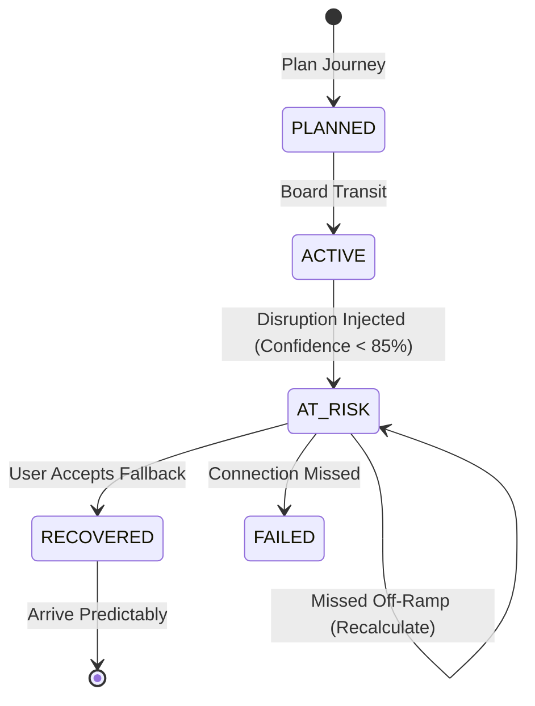

# Architecture Spine — FLOW MVP

## Design Paradigm

**Modular Monolith (Single-App Repository).** 
To optimize for a 3-person hackathon, implementation speed, and deterministic live demo performance, FLOW will be built as a single unified codebase. We explicitly reject microservices, distributed queues, or complex network boundaries. The backend and frontend will co-exist in one repository. Modules will be strictly separated by directory structure to allow parallel development without merge conflicts, but they will execute in the same runtime process for simplicity.

## Invariants & Rules

### AD-1 — P1 Isolation
- **Binds:** `modules/simulation`
- **Prevents:** P1 1,000+ commuter network simulation crashing or slowing down the P0 single-user journey demo.
- **Rule:** The P1 demand balancing and synthetic commuter engine MUST execute completely asynchronously or in a separate thread/worker from the P0 routing API. P0 APIs must never wait on P1 simulation calculations.

### AD-2 — Deterministic GTFS Simulation
- **Binds:** `modules/routing`, `modules/simulation`
- **Prevents:** The hackathon demo failing due to unreliable or offline external third-party transit APIs.
- **Rule:** The system MUST support a fully deterministic "mock mode" where static GTFS schedules and historical P95 delays are loaded from local JSON/SQLite files. Delays are injected via an internal API, not by polling an external live feed.

### AD-3 — Strict Explainability Contract
- **Binds:** `modules/journey`
- **Prevents:** Unexplained AI/black-box routing recommendations.
- **Rule:** Any state transition from `ACTIVE` to `AT_RISK` MUST generate a structured `DecisionExplanation` payload containing `whatChanged`, `why`, `howAffects`, and `recommendation`. This payload must be passed directly to the UI.

### AD-4 — Fallback Score Normalization
- **Binds:** `modules/routing`
- **Prevents:** Invalid weighting math where raw metrics (like minutes and dollars) are improperly added together.
- **Rule:** All fallback components (Reliability, Time, Cost, Eco) MUST be normalized to a 0–100 scale *before* applying the user's `wR, wT, wC, wE` weights.

## Consistency Conventions

| Concern | Convention |
| --- | --- |
| Naming | Domain entities: `Journey`, `Leg`, `Transfer`, `Disruption`. |
| Data & Formats | All times stored as UTC ISO 8601 strings. Durations in integer seconds. Confidence as 0.00-1.00 float (displayed as %). |
| State | Journey States: `PLANNED`, `ACTIVE`, `AT_RISK`, `RECOVERED`, `FAILED`. |

## Stack

| Name | Version |
| --- | --- |
| [ASSUMPTION] Next.js (TypeScript) | 14.x |
| [ASSUMPTION] SQLite | 3.x |
| [ASSUMPTION] Prisma ORM | 5.x |
| [ASSUMPTION] TailwindCSS | 3.x |
| [ASSUMPTION] Recharts (for P1 dashboard) | 2.x |

*(Rationale for Assumption: Next.js + SQLite provides the absolute fastest zero-configuration setup for a unified frontend/backend monolithic hackathon project. It runs perfectly locally and requires no external database hosting).*

## Structural Seed

```text
flow-mvp/
  app/                      # Next.js Frontend Routes
    (commuter)/             # P0: Aarav's UI (Plan, Active Journey, Alert)
    (operator)/             # P1: Simulation Dashboard
  lib/
    db/                     # SQLite Schema & Prisma Client
    modules/
      routing/              # DEV 1: Connection Buffer, Risk Margin, Fallback Score math
      journey/              # DEV 1: State machine, Explainability payload generation
      simulation/           # DEV 3: Delay injection, 1000+ synthetic commuter distribution
  static-data/              # Local GTFS JSON files (ensures offline reliability)
```

## Core Domain Models & Math

### 1. The Math Contract
**Connection Confidence Normalization (Configurable Heuristic):**
*Risk Margin = (Predicted Arrival Time − Required Transfer Time) − Historical P95 Delay*
*Normalization (Linear Clamp Model):*
`Confidence = MAX(0, MIN(100, 50 + (Risk Margin_In_Minutes * 10)))`
*(e.g., 0 min margin = 50% confidence. +5 min margin = 100%. -5 min = 0%. Configurable via env var).*

### 2. State Machine


## Deferred

- **Live GTFS-RT Integration:** Deferred to P2/Future. MVP relies on the deterministic local simulation engine for reliable judging.
- **True Network Graph Routing:** Deferred. MVP will use pre-calculated origin-destination route options rather than implementing a full Dijkstra/A* transit graph engine from scratch, saving massive hackathon time.
